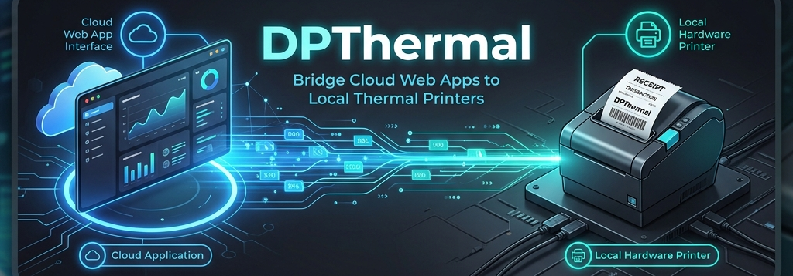

<div align="center">
  
</div>

# DPThermal

DPThermal is a lightweight local HTTP service that acts as a bridge between web applications and receipt printers (Thermal or Dot Matrix) installed on your computer (Windows/Linux) via Spooler (USB/LAN) or Bluetooth.

Your web application simply sends an HTTP POST request (JSON) to DPThermal, and DPThermal will convert it into ESC/POS commands or plain text, forwarding it to the printer.

## Key Features

- **Structured Receipt Printing**: Send a list of items (text, lines, barcodes/QR, images) with format support compatible with MaxThermal Android.
- **Text & Image Printing (ESC/POS)**: Supports alignment, font size, styling (bold/underline), and image printing (with dithering).
- **Dot Matrix / Plain Text**: Fallback mode for non-thermal printers (such as EPSON LX-310).
- **Auto-Detect Printers**: Automatically detects printers installed in the OS (Spooler) and Bluetooth (RFCOMM).
- **Web UI**: Equipped with a local web dashboard for testing, viewing logs, and API documentation.

## Usage (Installation & Running)

### 1. Download Executable
Please download the DPThermal application suitable for your OS or device from the links below:

**[Download DPThermal V1.0 Portable (Desktop)](https://github.com/andyresta/dpthermal-dekstop/releases/tag/V1.0)**

- **Windows 64-bit**: `dpthermal-windows-amd64.exe`
- **Windows 32-bit**: `dpthermal-windows-386.exe`
- **Linux 64-bit**: `dpthermal-linux-amd64`
- **Linux ARM (Raspberry Pi, etc.)**: `dpthermal-linux-arm` or `dpthermal-linux-arm64`

**[Download DPThermal V1.0 (Android)](https://github.com/andyresta/dpthermal-android/releases/tag/v1.0)**

- **Android APK**: `app-release.apk`

### 2. Running the Application
- **Windows**: Simply double-click the downloaded `.exe` file.
- **Linux**: Grant executable permission first via the terminal, then run the application:
  ```bash
  chmod +x dpthermal-linux-amd64
  ./dpthermal-linux-amd64
  ```

Once executed, the service will automatically run in the background and open the DPThermal settings dashboard in your default browser at the URL: `http://localhost:8080`.

### 3. Printer Configuration
   Open the UI (`http://localhost:8080`) and go to the **Settings** tab.
   Select your active printer, choose the **Printer Mode** (Thermal or Dot Matrix), and **Paper Width** (58mm or 80mm).
   Click **Save Settings**.

## API Integration (Receipt Specific)

DPThermal supports a specific endpoint `/api/print/receipt` (alias: `/print/receipt`) for printing structured receipts. This endpoint is highly useful for printing sales invoices with a neat layout.

**Endpoint:** `POST http://localhost:8080/api/print/receipt`
**Content-Type:** `application/json`

### Payload Format

The payload uses an `items` array containing a sequence of print commands. Here is an example JSON payload:

```json
{
  "items": [
    { "type": "text", "align": "center", "size": 2, "style": "bold", "data": "STORE NAME" },
    { "type": "text", "align": "center", "data": "123 Example Street" },
    { "type": "line", "style": "double" },
    { "type": "text", "data": "Fried Rice       x2   30.000" },
    { "type": "text", "data": "Iced Tea         x2   10.000" },
    { "type": "line" },
    { "type": "text", "align": "right", "size": 2, "style": "bold", "data": "TOTAL: Rp 40.000" },
    { "type": "feed", "data": "1" },
    { "type": "qr", "align": "center", "size": 200, "data": "https://store.example.com/inv/12345" },
    { "type": "text", "align": "center", "style": "bold", "data": "Thank you!" },
    { "type": "feed", "data": "3" }
  ],
  "cut_paper": true,
  "width_mm": 80,
  "copies": 1
}
```

### Item Types Explanation (`type`)

- **`text`**: Prints a line of text.
  - `align`: `left` | `center` | `right` (default: `left`)
  - `size`: `1` - `8` (font character size, default: `1`)
  - `style`: `bold` | `underline` | `bold,underline`
  - `data`: The text to be printed.
- **`line`**: Prints a horizontal separator line.
  - `style`: `single` (`-`) | `double` (`=`) | `dotted` (`.`)
- **`qr`**: Generates & prints a QR Code.
  - `align`: `left` | `center` | `right` (default: `center`)
  - `size`: QR generation resolution in px (default: `200`)
  - `data`: QR Code content/URL.
- **`image`**: Prints an image (Thermal mode only).
  - `align`: `left` | `center` | `right` (default: `center`)
  - `data`: Base64 string of a PNG/JPEG image (e.g., `data:image/png;base64,...`).
- **`feed`**: Adds blank lines (paper feed).
  - `data`: Number of lines (e.g., `"3"`).

*Note: In **Dot Matrix** mode, items of type `qr` and `image` will not be printed as they are not supported by the printer.*

### JavaScript/Frontend Integration Example

You can use the `fetch` function in your web application's JavaScript to send print commands directly to the local DPThermal service:

```javascript
async function printReceipt(items) {
  try {
    const res = await fetch('http://localhost:8080/api/print/receipt', {
      method: 'POST',
      headers: { 'Content-Type': 'application/json' },
      body: JSON.stringify({
        items: items,
        cut_paper: true
      })
    });
    
    const data = await res.json();
    if (data.success) {
      console.log("Print successful! Job ID:", data.job_id);
    } else {
      console.error("Print failed:", data.message);
    }
  } catch (err) {
    console.error("DPThermal service not detected or offline.", err);
  }
}
```

For detailed API documentation (Separate Text / Image Printing), you can open the DPThermal dashboard in your browser and navigate to the **API Documentation** tab.
